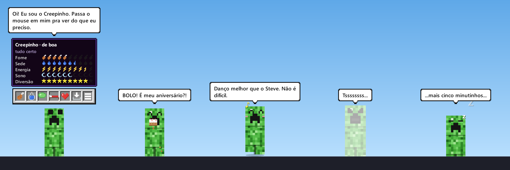

# Creeper Companion

Um creeper de estimação que mora na sua tela. Ele anda em cima da barra de tarefas, sente fome, sede,
cansaço e sono, fala (com bastante humor) e, se for muito cutucado, explode. Depois volta emburrado.

Funciona no **Windows** e no **Linux** (GNOME incluído).



## Como abrir

- **Windows (mais fácil):** baixe o instalador na
  [página do Creeper Companion](https://leandroneckel.github.io/creeper_companion/) e siga os passos de lá.
  Não precisa ser administrador; ele cria o atalho no Menu Iniciar e se atualiza sozinho depois.
  Prefere sem instalar? O `CreeperCompanion.exe` da
  [última versão](https://github.com/leandroneckel/creeper_companion/releases/latest) abre direto (deixe numa
  pasta sua, porque é ali que ele se atualiza).
- **Windows, pelo código:** dois cliques em `iniciar_windows.bat`. Na primeira vez ele cria o ambiente e instala
  as dependências.
- **Linux:** `./iniciar_linux.sh`

Ou, manualmente:

```bash
python -m venv .venv
.venv/bin/pip install -r requirements.txt      # Windows: .venv\Scripts\pip ...
.venv/bin/python main.py                        # Windows: .venv\Scripts\pythonw.exe main.py
```

Só abre uma cópia por vez: rodar de novo apenas traz o creeper de volta da bandeja.

## Como interagir

| Ação | Como |
|---|---|
| Ver como ele está | Passe o mouse em cima: aparece a barra de botões e, logo depois, o painel de status |
| Comer, beber, atividades, dormir | Botões da barra, ou clique direito nele, ou menu do ícone da bandeja |
| Fazer carinho | Passe o mouse de um lado pro outro em cima dele (ou use o botão ❤) |
| Cutucar | Clique nele (cuidado: muitos cutucões em seguida fazem ele chiar e explodir) |
| Carregar | Clique e arraste; ao soltar ele cai. Chacoalhar deixa ele tonto |
| Mandar pra bandeja | Botão de "recolher" na barra; clique no ícone da bandeja pra trazer de volta |
| Acalmar quando estiver chiando | Faça carinho rápido antes de ele explodir |
| Abrir presente | Clique no presente no chão ao lado dele (ou "Abrir presente" no menu) |

### Necessidades

Cada uma vai de 0 a 100 (cheio = bem). O painel mostra no estilo da barra de fome do Minecraft.

- **Fome e sede** caem com o tempo e com exercício.
- **Energia** cai com exercício e volta quando ele descansa ou dorme.
- **Sono** cai ao longo do dia (mais rápido à noite) e só volta dormindo.
- **Diversão** cai com o tédio; sobe com atividades, carinho e guloseimas.

Com o app fechado o tempo passa bem mais devagar, e nada cai abaixo de 15. Ele não morre:
no máximo fica de mau humor.

Alguns itens têm efeitos: **café** (tira o sono, mas deixa agitado e atrapalha dormir), **carne podre**
(enjoo), **leite** (cura enjoo e café), **maçã dourada** (fica brilhando, necessidades congeladas por
10 min), **poção de velocidade**. E nunca traga um gato.

### XP, níveis e presentes

A barra verde no painel é o XP, como no Minecraft. Ele ganha XP:

- com o **tempo junto** (app aberto e você usando o PC);
- quando você **cuida dele** (comida, bebida, atividades, carinho), com um limite por hora;
- com um **bônus** enquanto ele está bem cuidado;
- quando **você se cuida**: os lembretes de água e de pausa vêm com um botão **Fiz!**.

Se alguma necessidade fica crítica, ele vai **perdendo XP** aos poucos, mas nunca desce de nível.
Os primeiros níveis saem em horas; depois, mais ou menos um por dia de uso.

Cada nível novo traz um **presente**, e de vez em quando ele acha um sozinho. O presente aparece no chão
ao lado dele (e ele fica por perto esperando você abrir). Dentro vem um item especial (maçã dourada ou
uma poção) ou XP. Os itens especiais têm quantidade (o número aparece no menu); os outros são infinitos.

Subindo de nível você desbloqueia coisas novas (no menu, as trancadas aparecem como "??? (nível N)"):

| Nível | Desbloqueia |
|---|---|
| 2, 3, 7 | Baga doce, fatia de melancia, peixe assado |
| 4 | **Minerar**: ele quebra blocos com a picareta (às vezes sai diamante) |
| 6 | **Poção de salto**: pulos altíssimos por 3 min |
| 9 | **Pescar**: peixe, bota velha ou, com sorte, um item especial |
| 11 | Garrafa de mel (cura enjoo) |
| 13 | **Plantar uma flor**: ele cava, planta e a flor cresce |
| 14 | **Poção de encolher**: fica do tamanho de um botão por 3 min |
| 16 | Sopa de beterraba |
| 18 | **Cavalgar um porco** |
| 20 | **Poção de invisibilidade**: fica quase transparente por 2 min |
| 22 | Cenoura dourada |
| 24 | **Poção de cura**: tira o emburrado e os efeitos ruins |
| 26 | **Fogos de artifício** |

### Guarda-roupa

Os níveis também liberam visuais, que ficam no menu **Guarda-roupa** (cada coisa nova já vem vestida):

| Nível | Visual |
|---|---|
| 5, 12, 21, 28 | Chapéus: abóbora esculpida, cartola, coroa, capacete de diamante |
| 8, 15, 23 | Cores: neve, outono, noturno (com o rosto brilhando) |
| 10, 19, 27 | Rastros ao andar: folhas, faíscas, corações |
| 30 | **Creeper carregado**: aura elétrica, chega com raio e trovão (e explode maior) |

### Brincadeiras e comportamentos

E ele aprende coisas novas (no menu **Brincadeiras**; as duas automáticas dá pra desligar nas Configurações):

| Nível | Aprende |
|---|---|
| 3 | **Vir quando chamado**: "Vem cá!" no menu, ou clique do meio no ícone da bandeja. Ele corre até o mouse (e aparece no monitor certo) |
| 11 | **Bolinha**: arraste a bolinha e solte com força; ela quica pela tela e ele busca e traz de volta |
| 17 | **Brincar sozinho**: feliz e à toa, de vez em quando ele dança, pula, pesca ou minera por conta própria |
| 25 | **Esconde-esconde**: ele some e fica só um pedacinho aparecendo (na borda da tela, atrás de uma janela ou enterrado no chão). Clique nele em até 90 s. Ele espia e dá risadinhas pra ajudar |
| 29 | **Subir nas janelas**: pula em cima das janelas abertas, anda pela borda e cai quando chega na ponta ou a janela fecha. Solto em cima de uma janela, ele pousa nela |

**Conquistas** (como "Tsss... BUM!" e "Uma semana juntos") aparecem num aviso no canto da tela e dão XP
extra. A lista fica no menu, em **Conquistas**.

### Ele também cuida de você

- Lembra de **beber água** (a cada 60 min de uso).
- Sugere **pausas** depois de 50 min seguidos no computador.
- Depois da meia-noite, manda você **ir dormir**.
- Se você ficar 15 min longe do PC e ele estiver com sono, tira um cochilo e acorda quando você volta.
- Some sozinho quando algum app está em **tela cheia** (jogo, apresentação, vídeo).

Tudo isso pode ser ligado/desligado em **Configurações** (clique direito nele ou no ícone da bandeja).

### Sons

Ele chia antes de explodir (no ritmo do pisca-pisca), mastiga, dá goles, às vezes arrota, faz "bup" quando
é cutucado, "plim" com carinho e nos lembretes, e toca uma melodia improvisada quando dança. O gato mia.

- Desligar ou mudar o volume: **Configurações → Sons**.
- Só faz barulho quando está na tela: na bandeja ou escondido por tela cheia, fica quieto.
- Pra ouvir todos os sons em sequência: `python tools/preview_sounds.py` (ou `... pop miau` pra só alguns).

## Versões novas

Quando sai uma versão nova, o creeper avisa num balão (ou num aviso da bandeja) e mostra o que mudou. Aí dá pra
**atualizar agora** (ele baixa, confere e reabre sozinho em poucos segundos), deixar pra **depois** ou **pular
aquela versão**. Nível, itens e o resto do progresso ficam salvos à parte e continuam iguais.

- Só procura sozinho se deixarem: o instalador tem a opção (já marcada) e, sem instalador, o creeper pergunta na
  primeira vez que abre (botão **Pode!**). Aí ele procura 1 minuto depois de abrir e depois a cada 6 horas.
  Fora isso ele não usa a internet. Dá pra procurar na hora ou ligar/desligar em **Configurações**.
- Rodando pelo código-fonte ele só avisa; pra atualizar, `git pull`.

### Publicar uma versão (pra quem mantém o projeto)

```bash
pip install -r requirements-dev.txt    # PyInstaller
winget install JRSoftware.InnoSetup     # gera o instalador
gh auth login                           # GitHub CLI, uma vez só
python tools/release.py 1.2.0           # gera o .exe e o instalador, cria a tag v1.2.0 e a release
```

O script confere que o git está limpo e em dia, mostra as notas (por padrão, os títulos dos commits desde a
última versão; ou use `--notas "..."`) e pergunta antes de publicar. A release leva dois arquivos:
`CreeperCompanion-Setup.exe` (o que as pessoas baixam na primeira vez) e `CreeperCompanion.exe` (o que a
atualização automática baixa). Na primeira vez ele também liga o GitHub Pages, que publica a página de download
(`docs/index.html`) em https://leandroneckel.github.io/creeper_companion/.

Pra só gerar os arquivos e testar: `python tools/build_exe.py` (saem em `dist/`).

**Assinatura digital (opcional):** com um certificado de assinatura de código instalado no Windows, defina
`CREEPER_CERTIFICADO` com a impressão digital (thumbprint) dele antes de gerar, e o `.exe` e o instalador saem
assinados (com carimbo de tempo).

## Áreas de trabalho virtuais

- **Windows:** a janela é do tipo "tool window". O Windows não a associa a nenhuma área de trabalho
  virtual, então ela aparece em todas, sem precisar de APIs não documentadas.
- **Linux:** a janela é criada fora do controle do gerenciador de janelas (`X11BypassWindowManagerHint`),
  o que a mantém em todas as áreas de trabalho e acima das outras janelas. No GNOME com Wayland o app
  roda via XWayland automaticamente (`QT_QPA_PLATFORM=xcb`), porque o Wayland não permite isso
  para apps comuns.

### Observações para Linux

- No Ubuntu/Debian pode ser preciso: `sudo apt install libxcb-cursor0`.
- O ícone na bandeja no GNOME depende da extensão **AppIndicator** (já vem ativa no Ubuntu).
  Sem ela, o creeper continua funcionando, só não dá pra recolher pra bandeja.
- A detecção de inatividade usa o `org.gnome.Mutter.IdleMonitor` (GNOME) ou `xprintidle`.
- Subir nas janelas e se esconder atrás delas usa o `wmctrl` (`sudo apt install wmctrl`) e só funciona no X11.
  No Wayland ele não enxerga as outras janelas: continua usando as bordas da tela e o chão.
- O som usa o servidor de áudio do sistema (PipeWire/PulseAudio, que já vêm no Ubuntu). Se o Qt não
  conseguir abrir o áudio, o creeper só fica mudo.

## Personalizar

- **Comidas, bebidas e atividades:** `content/itens.yaml`. Cada item pode ter um nível de desbloqueio
  (`nivel`) e virar limitado (`limitado`); o começo do arquivo explica.
- **Falas:** `content/falas.yaml`. Dá pra adicionar quantas quiser em cada situação.
- **Conquistas:** `content/conquistas.yaml` (nome, meta, XP e ícone de cada uma).
- **Dados salvos:** `%APPDATA%\CreeperCompanion\save.json` (Windows) ou
  `~/.config/creeper-companion/save.json` (Linux). Os sons gerados ficam em cache na pasta `sons/` ao lado.

## Estrutura

```
main.py                 entrada (instância única, Wayland -> XWayland)
creeper/
  app.py                liga tudo: laço principal, lembretes, bandeja, salvamento
  pet.py                comportamento: estados, reações, falas, partículas
  needs.py              necessidades, efeitos, humor
  progress.py           XP, níveis, estoque, presentes e conquistas
  cosmetics.py          guarda-roupa: chapéus, cores, rastros, creeper carregado
  tricks.py             comportamentos que ele aprende (vir quando chamado, bolinha...)
  surfaces.py           janelas abertas viram lugares pra subir e se esconder
  ball.py               física da bolinha
  config.py             configurações e salvamento
  updater.py            versão nova: consulta o GitHub, baixa, confere e troca o executável
  content.py            leitura dos YAML
  art/sprite.py         o creeper em pixel art (gerado por código) e suas expressões
  art/icons.py          ícones 12x12 dos itens e das barras de status
  sound/synth.py        os sons, sintetizados por código (Python puro)
  sound/player.py       toca os sons: cache dos WAV, volume, mudo
  ui/pet_window.py      janela transparente, balão, barra de botões, painel, mouse
  ui/menus.py           menus estilo Minecraft
  ui/toast.py           aviso "Conquista feita!" no canto da tela
  ui/ball_window.py     a bolinha na tela (dá pra agarrar e arremessar)
  ui/tray.py            ícone da bandeja
  ui/update_dialog.py   janela "versão nova" (o que mudou; atualizar, depois, pular)
  desktop/              integração com o sistema (Windows / Linux)
content/                itens e falas (YAML)
tools/smoke_test.py     teste automático sem tela (python tools/smoke_test.py)
tools/preview_sprites.py  gera uma folha com todas as expressões e ícones
tools/preview_sounds.py   toca os sons um por um (ou salva os WAV)
tools/readme_image.py   gera a imagem do README (docs/creeper-companion.png)
tools/build_exe.py      gera o executável (PyInstaller) e o instalador (Inno Setup) em dist/
tools/instalador.iss    roteiro do instalador
tools/release.py        publica uma versão: executável + instalador + tag + release no GitHub
docs/index.html         página de download (GitHub Pages)
```

## Licença

Código sob a licença [MIT](LICENSE).

## Aviso

Projeto de fã, sem fins comerciais. Não é oficial nem associado à Mojang Studios ou à Microsoft.
"Minecraft" e "Creeper" são marcas da Mojang/Microsoft. Toda a arte deste projeto é desenhada por código
e todos os sons são sintetizados por código; nenhuma textura ou som do jogo é usado.

## Próximos passos

- Executável para Linux: o atualizador já sabe trocar um `CreeperCompanion-linux` anexado à release, falta gerar
  e testar numa máquina Linux.
- Certificado de assinatura de código (pago). O build já assina quando houver um (veja "Publicar uma versão").
- Conversa de verdade com ele via API do Claude (opcional, pago por uso).
